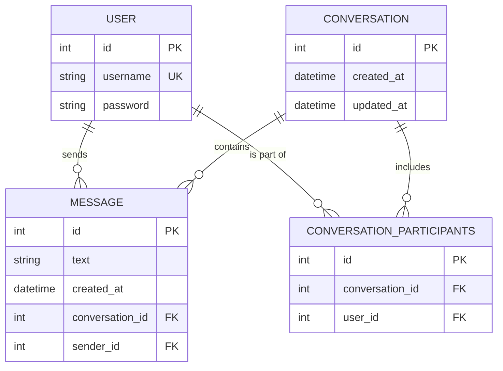

# Database Documentation & Schema

The Chat Platform uses **PostgreSQL** as its primary relational database, deployed seamlessly via Docker. This document outlines the schema, tables, and their roles within the application.

## Core Tables and Roles

### 1. `auth_user` (Users Table)
Managed automatically by Django's robust built-in authentication system.
- **Role**: Stores all user accounts, handles secure password hashing, and manages session state.
- **Key Columns**:
  - `id` (Primary Key)
  - `username` (Unique identifier for login and display)
  - `password` (Hashed and salted securely)

### 2. `chat_conversation` (Conversations Table)
- **Role**: Represents a chat room or a thread between two or more users. It acts as the parent container for messages.
- **Key Columns**:
  - `id` (Primary Key)
  - `created_at` (Timestamp of when the conversation started)
  - `updated_at` (Timestamp updated whenever a new message is sent)

### 3. `chat_conversation_participants` (Many-to-Many Linking Table)
- **Role**: Since a conversation can have multiple users, and a user can be in multiple conversations, this pivot table links `auth_user` and `chat_conversation`.
- **Key Columns**:
  - `id` (Primary Key)
  - `conversation_id` (Foreign Key -> `chat_conversation.id`)
  - `user_id` (Foreign Key -> `auth_user.id`)

### 4. `chat_message` (Messages Table)
- **Role**: Stores the actual chat messages sent by users within a specific conversation.
- **Key Columns**:
  - `id` (Primary Key)
  - `text` (The string content of the message)
  - `created_at` (Chronological timestamp of when the message was sent)
  - `conversation_id` (Foreign Key -> `chat_conversation.id`)
  - `sender_id` (Foreign Key -> `auth_user.id`)

---

## Entity-Relationship Schema

## How It Works Together
1. When two users want to chat, a `CONVERSATION` row is created.
2. Both users' IDs are added to the `CONVERSATION_PARTICIPANTS` table, linking them to that specific conversation.
3. Every time they chat, a `MESSAGE` row is created holding the text, tied directly to the `CONVERSATION` and the specific `USER` who sent it.
